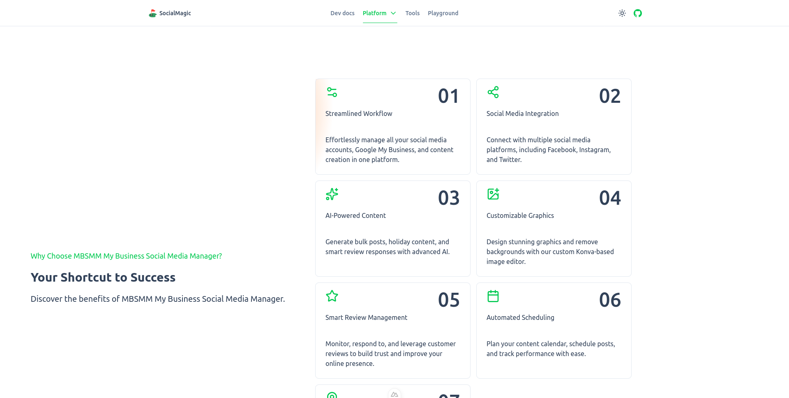

# Social media scheduling using Nuxt layers

## Project layers Structure using Monorepo

1. @local-monorepo/db
2. @local-monorepo/auth
3. @local-monorepo/assets
4. @local-monorepo/scheduler
5. @local-monorepo/connect
6. @local-monorepo/tools
7. @local-monorepo/ai-tools
8. @local-monorepo/bulk-scheduler
9. @local-monorepo/content
10. @local-monorepo/site
11. @local-monorepo/ui
12. @local-monorepo/email
13. @local-monorepo/doc

## Explanation for each layer

1. @local-monorepo/db
> All related database call or connections will be here
> Query to the db will be here from user information to assets information.
- Database will have the connection configuration
- Schema for the following:
    - User
    - Post
    - Connection
    - Tool
    - Template
    - Prompt
    - Email
    - Settings
    - Log
    - assets
    - business

2. @local-monorepo/auth

> The auth layer will be using the Better auth package
> The routes for the ui for the login, registration, logout will be here.
> User role management will be here api.
- User can register
- User can login
- User can logout
- User can change password
- User can change email
- User can verify email
- Admin user can manage users
- Admin user can ban users

3. @local-monorepo/assets
> All related assets will be here, from Upload, download, external api call for images example Pexel API
> Upload, single to bulk images.

4. @local-monorepo/scheduler
> The api for scheduling one or more post will be here
> The UI for the scheduling will be here as well

- User can view the post scheduler
- Api will trigger post base on the schedule
- User can create a new schedule
- User can edit a schedule
- User can delete a schedule
- User can view the calendar view of the schedules
- User can view the list view of the schedules
- User can export the schedules to a csv file

5. @local-monorepo/connect
> Supported platforms will be here
> API for the connection handlers will be here
> UI for the connection handlers will be here, Ui for the connected platforms as well
- User can see all the supported platforms
- User can connect to a platform
- User can disconnect from a platform
- User can see all the connected platforms
- User can group the connected platforms
- User can see all the groups
- User can add a group
- User can edit a group
- User can delete a group
- User can edit the platform details

6. @local-monorepo/tools
> All related tools will be here
> UI for the tools will be here
> Tools will be target to be public tools to get seo rank and traffic, most tools will use the Transformerjs library
> Example: Auto generate images from text base on a template html to png image
> UI for the preview for the images will be here
- In browser tools for social media
- In browser tools for email
- In browser tools for chat
- In browser tools for social media preview generator
- In browser tools for email preview generator
- In browser tools for transcription

7. @local-monorepo/ai-tools
> All related tools will be here
> UI for the tools will be here

> Example: Auto generated post for  social media, based on a prompt or the user business details, 
> like the business name, description, and the user profile.
> UI for the preview for the generated post will be here
> Chat interface for the ai tools
- User can ask for a new social media post, base on user prompt 
- User can ask to re-generate social media post base on the current post
- All post will be generated and formatted to be ready for social media and formatted to with text + hashtags

8. @local-monorepo/bulk-scheduler
> The api for generating bulk post will be here and bulk scheduling
> The UI for the scheduling will be here as well

- User can generate bulk post and schedule from date A to date B for multiple platforms
- User can generate bulk post, with auto generated images base on a template html and schedule from date A to date B for multiple platforms

9. @local-monorepo/content
> Here we handle the Static content like the blog posts, and static pages for the application
- Home pages
- About page
- Contact page
- Privacy policy
- Terms of service

10. @local-monorepo/site

> Here is where all the  Layers will be merged together
> The UI  for the combined layers will be here

- Seo for the site
- Sitemap for the site
- Robots for the site
- Favicon for the site

11. @local-monorepo/ui
> The base UI for all the layers will be here
- UI layer will be using the Nuxt UI,
- UI layer will expose the UI components with a prefix like Base-, example `BaseButton.vue` that will be just a proxy to the Nuxt UI `Button.vue`

12. @local-monorepo/email
> The email service will be here
> The email templates will be here
- User can edit the email template
- User can have preview of the email template
- All email that the system send will be here
- User can update the email settings

13. @local-monorepo/doc

> The documentation for the layers will be here
> The documentation for the ui will be here

## Setup

1. Clone the repository
2. Run `pnpm install`
3. Run `pnpm dev`
4. Run `pnpm build`
5. Run `pnpm start`

### Specific layer

1. Run `pnpm packages [layer] install`
2. Run `pnpm packages [layer] dev`
3. Run `pnpm packages [layer] build`
4. Run `pnpm packages [layer] start`

Example : 

`pnpm packages ui dev` for the dev server for the ui Layer 

## Todos:
- [x] Set up the UI Layer using Nuxt UI
    - [x] Create the components that will be used in the Home page
    - [ ] Create the components that will be used in the About page
    - [ ] Create the components that will be used in the Contact page
    - [ ] Create the components that will be used in the Privacy policy page
    - [ ] Create the components that will be used in the Terms of service page
    - [ ] Create the components that will be used in the Blog page
    - [ ] Create the components that will be used in the Blog post page

- [] Create the static content layer
    - [ ] Create Home, About, Contact, Privacy policy, Terms of service
    - [ ] Create Blog posts for each task that is done.

- [ ] Create the tools layer
    - [ ] Create the tools for social media
    - [ ] Create the tools for email
    - [ ] Create the tools for chat
    - [ ] Create the tools for social media preview generator
    - [ ] Create the tools for email preview generator
    - [ ] Create the tools for transcription
    - [ ] Create the tools for Text over image

- [ ] Set up the Database Layer
  - [ ] Create User model
  - [ ] Create Post model
  - [ ] Create Schedule model
  - [ ] Create Task model
  - [ ] Create Group model
  - [ ] Create Message model
  - [ ] Create Platform model

- [ ] Set up the Email Layer
    - [ ] Create template email for User Registration
    - [ ] Create template email for User Password Reset
    - [ ] Create template email for User Password Change
    - [ ] Create template email for User confirmation
    - [ ] Create template email for User Subscription
    - [ ] Create template email for User Unsubscription
    - [ ] Create template email for Post Schedule trigger
    - [ ] Create template email for Post Schedule fail
    - [ ] Create template email for Post Schedule reminder

- [ ] Set up the Auth Layer
    - [ ] Create login page
    - [ ] Create signup page
    - [ ] Create forgot password page
    - [ ] Create reset password page
    - [ ] Create confirm email page
    - [ ] Create subscription page
    - [ ] Create unsubscribe page
    - [ ] Create profile page
    - [ ] Create settings page
    - [ ] Set up the middleware for the auth
    - [ ] Set up the middleware for the admin
    - [ ] Set up the middleware for the guest
    - [ ] Set up the middleware for the user
    - [ ] Set up the middleware for the subscription
    - [ ] Set up the middleware for the schedule rights
    - [ ] Set up the Better Auth package

- [ ] Set up the Scheduler Layer
    - [ ] Create the api for scheduling one or more post
    - [ ] Create the UI for the scheduling
    - [ ] Create the api for generating bulk post
    - [ ] Create the UI for the bulk scheduling
    - [ ] Create the api for generating bulk post with auto generated images
    - [ ] Create the UI for the bulk scheduling with auto generated images
    - [ ] Create the Calendar view for the schedules
    - [ ] Create the List view for the schedules
    - [ ] Create the api for exporting the schedules to a csv file
    - [ ] Create the api for importing the schedules from a csv file

- [ ] Set up the Connect Layer
    -[ ] Create UI & API for supported platforms
    -[ ] Create UI & API for connected platforms
    -[ ] Create UI & API for groups
    -[ ] Create UI & API for group details
    -[ ] Create UI & API for group creation
    -[ ] Create UI & API for group editing
    -[ ] Create UI & API for group deleting
    -[ ] Create UI & API for platform details
    -[ ] Create UI & API for platform creation
    -[ ] Create UI & API for platform editing
    -[ ] Create UI & API for platform deleting
    -[ ] Create UI & API for platform connection
    -[ ] Create API for connecting to a platform
    -[ ] Create API for disconnecting from a platform

- [ ] Set up the AI Layer
    - [ ] Create the api for generating post
    - [ ] Create the UI for the post generation
    - [ ] Create the api for generating bulk post
    - [ ] Create the UI for the bulk post generation
    - [ ] Create the api for generating bulk post with auto generated images
    - [ ] Create the UI for the bulk post generation with auto generated images

- [ ] Set up the Analytics Layer
    - [ ] Create the api for analytics
    - [ ] Create the UI for the analytics

- [ ] Set up the assets Layer
    - [ ] Create the api for CRUD operations for assets
    - [ ] Create the UI for the CRUD operations for the assets
    - [ ] Create UI & API to create template assets